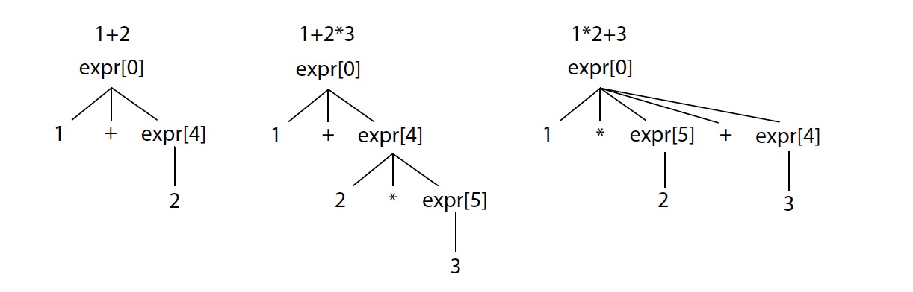

# Lab1-3 Report

PB15111610 张一卓

## 实验内容

在前两步实验结果的基础上，修改并完善课程实验软件包中 的 src/syntax_tree_builder.cpp，并将src/recognizer.cpp 中第 44 行代码更改为以**`compilationUnit`**作为开始符号来解析。同时，使用编译链接生成的可执行程序 `c1r_test` 来测试生成的分析器。

此外，还要阅读ANTLR 生成的解析器源码、所使用的ANTLR 运行时的源码以及相关的文献，深入理解 ANTLR 所基于的分析技术和实现策略。比较它与常规的 LL分析方法的区别，总结它对分析中遇到的试探策略以及试探失败后的处理机制。

## 实验分析

### 对分析树编程接口的观察

在 antlr 根据所写的``C1Parser.g4``生成的``C1Parser.h``中，可以很清楚看到 Parse Tree 的结构以及它与所定义的文法之间的关系。Parse Tree 的结构主要就体现在其中形如``xxxContext``的类中，总共有如下几个类：

```c++
  class CompilationUnitContext;
  class DeclContext;
  class ConstdeclContext;
  class ConstdefContext;
  class VardeclContext;
  class VardefContext;
  class FuncdefContext;
  class BlockContext;
  class StmtContext;
  class LvalContext;
  class CondContext;
  class ExpContext; 
```

显然，每一类都对应了文法文件中定义的一个非终结符。下面以``ExpContext``类为例，看看里面都有什么成员：

```c++
class  ExpContext : public antlr4::ParserRuleContext {
  public:
    ExpContext(antlr4::ParserRuleContext *parent, size_t invokingState);
    virtual size_t getRuleIndex() const override;
    std::vector<ExpContext *> exp();
    ExpContext* exp(size_t i);
    antlr4::tree::TerminalNode *Plus();
    antlr4::tree::TerminalNode *Minus();
    antlr4::tree::TerminalNode *LeftParen();
    antlr4::tree::TerminalNode *RightParen();
    LvalContext *lval();
    antlr4::tree::TerminalNode *Number();
    antlr4::tree::TerminalNode *Multiply();
    antlr4::tree::TerminalNode *Divide();
    antlr4::tree::TerminalNode *Modulo();

    virtual void enterRule(antlr4::tree::ParseTreeListener *listener) override;
    virtual void exitRule(antlr4::tree::ParseTreeListener *listener) override;

    virtual antlrcpp::Any accept(antlr4::tree::ParseTreeVisitor *visitor) override;
   
  };
```

结合所定义的``exp``的文法：

```antlr
exp:
    exp (Plus | Minus | Multiply | Divide | Modulo) exp
    | (Plus | Minus) exp
    | LeftParen exp RightParen
    | Number
    | lval
;
```

可以看到，每一个出现在exp产生式右部的符号（终结&非终结符）都有相应的接口函数。对于终结符，比如``antlr4::tree::TerminalNode *Plus()``这样的接口，返回的是 Parse Tree中对应的终结符结点，如果不存在，那么返回``nullptr``；对于非终结符，有两种情况：1. 比如``LvalContext *lval();``接口，它会返回对应的非终结符结点，如果不存在同上返回空指针，它是由于``lval``最多只可能出现一次。2. 比如``std::vector<ExpContext *> exp()``和``ExpContext* exp(size_t i)``接口，前者返回全部要相应的``exp``结点，后者返回第 i 个，它是由于产生式规则中可能存在多个`exp`非终结符。

### 对语法树结构的观察

本实验最核心的部分就是遍历 antlr 生成的 Parse Tree 来构建语法树。这里的语法树已经由助教定义好了数据结构，所以概括地说，只需要在 visit 某个结点的时候，补充好改结点在语法树中的成员就行。接下来以``exp``表达式为例，观察并分析了构建语法树的过程。``exp``的产生式规则已经在上文给出，它对于构建语法树同样很重要。

首先概述一下在``syntax_tree.h``中定义的数据结构，``syntax_tree_node``是最上层的一个结构，它有基本的属性 line, pos。大部分的子结点继承它而来，主要分为``stmt_syntax``和``expr_syntax``，这两个子结构又分别衍生出更细的分类，并且拥有自己独特的属性（下文可以看到）。

回到第一条产生式，是一个二元表达式。在``syntax_tree.h``中，很明显与之对应的语法结点为``struct binop_expr_syntax : expr_syntax``，这个二元表达式类继承了``expr_syntax``，它有属性操作符``op``，以及指向左部和右部的指针``lhs``和``rhs``，它们的类型为``ptr<expr_syntax>``。对于操作符``op``属性的赋值很容易，以加号为例：

```c++
auto result = new binop_expr_syntax; // 首先， new一个相应的语法结点 
if (ctx->Plus())	result->op = binop::plus;
```

意思是如果节点中有加号，那么就把语法结点的``op``属性赋值为加号，其中``ctx``是指向 Parse Tree 当前结点的指针。对于``lhs``这样的属性，由于二元表达式左部仍然是一个表达式，所以要这样写：

```c++
auto expressions = ctx->exp();  // 把包含所有 exp 的 vector 拿出来
result->lhs.reset(visit(expressions[0]).as<expr_syntax *>())；// vector中第一个exp对应二元表达式左部
```

其中的``reset, visit, as``函数的具体含义助教在注释中讲解的非常清楚，rhs 也同理。这里就不赘述了。

最后补上``syntax_tree_node``的属性 line, pos，以及返回值：

```c++
return static_cast<expr_syntax *>(result);
```

这样第一条产生式的语法树构建的思路就很清晰了。第二条产生式的语法结点是``unaryop_expr_syntax``，与第一条非常类似；第三条产生式不过是把``exp``加了一对括号而已，所以只需要直接返回：

```c++
return visit(expressions[0]);
```

而不需要另外定义语法树的结点。第四条产生式是``Number``，看起来简单实际上有一个专门的语法结点``literal_syntax``与之对应，这里需要注意：

```c++
result->line = number->getSymbol()->getLine();
```

调用的是``getSymbol()``。最后再补上缺漏的``lval``：

```c++
return static_cast<expr_syntax *>(visit(ctx->lval()).as<lval_syntax *>());
```

要非常小心``static_cast``返回的类型，在``visitExp()``中要返回``expr_syntax*``，而``visit(ctx->lval())``返回的是``lval_syntax*``，所以要特别处理。类似的情况还有很多，尤其是在``decl``的部分，经过反复调试才修改正确。

到此，``visitExp()``函数的构建，也就是语法树``exp``结点的构建就分析完毕，理解了它的思路，再去写其它的``visit()``函数就不难了。概括地说，就是根据产生式，寻找相应的语法结点，填充结点中的属性；另外有很多的细节要注意，比如不要忘记父类的属性，注意返回值的类型等等。

## 实验结果

在这次实验过程中，为了方便处理``compilationUnit``，将它的产生式展开修改为：

```
compilationUnit:	(decl | funcdef)+;
```

为了实现``const int``中``int``缺失的``warning``处理，将``constdecl``的产生式修改为：

```
constdecl: 	Const (Int)? constdef (Comma constdef)* SemiColon;
```

首先进行``c1r_test``的编译，在``build``目录下：

```shell
cd build
make -j
```

成功后首先测试一下一个简单的例子``simple.c1``：

```c
int i = 0;
void main()
{
    i = i + 1;
}
```

测试命令：

```shell
./c1r_test ../test/test_cases/simple.c1
```

运行结果：

```
{
    "type": "assembly",
    "line": 1,
    "pos": 0,
    "global_defs": [
        {
            "type": "var_def_stmt_syntax",
            "line": 1,
            "pos": 4,
            "is_const": false,
            "name": "i",
            "vardef_initializer": {
                "type": "literal_syntax",
                "line": 1,
                "pos": 8,
                "value": 0
            }
        },
        {
            "type": "func_def_syntax",
            "line": 2,
            "pos": 0,
            "name": "main",
            "body": {
                "type": "block_syntax",
                "line": 3,
                "pos": 0,
                "body": [
                    {
                        "type": "assign_stmt_syntax",
                        "line": 4,
                        "pos": 4,
                        "target": {
                            "type": "lval_syntax",
                            "line": 4,
                            "pos": 4,
                            "name": "i"
                        },
                        "value": {
                            "type": "binop_expr_syntax",
                            "line": 4,
                            "pos": 8,
                            "op": "plus",
                            "lhs": {
                                "type": "lval_syntax",
                                "line": 4,
                                "pos": 8,
                                "name": "i"
                            },
                            "rhs": {
                                "type": "literal_syntax",
                                "line": 4,
                                "pos": 10,
                                "value": 1
                            }
                        }
                    }
                ]
            }
        }
    ]
}
```

可以看到结果是正确的，另外还编写了一个更完整的测试样例，里面包含了文法定义的大部分语句``test.c1``：

```c
const i = 1;
const int array[3] = {1,2,3};
int s1[6];
int s2[] = {1,2,3,4};
int s3[3] = {1,2,3};
void main()
{
    int j = 5;
    if(i == 2)
        j = 3;
    else
        j = 10;
    while(j < 10)
    {
        j = j * 3;
        if(j == 5)
            j = j - 1;
    }
}
```

由于结果非常长，就不在这里给出，只需观察到第一行漏了``int``，会给出``warning``:

```shell
Warning at position 1:0 : 'int' is missing.
```

## 深入理解 ANTLR

- ATN的英文全称是什么，它代表什么？

  ATN 的全称是 **Augmented Transition Networks** ，中文名是扩充转移网络。它是自然语言自动处理的一种方法，由美国人工智能专家W.A.伍兹提出。**它的本质就是 Paser 的一种实现方式。**它采用状态图来控制自然语言的分析过程。每幅状态图相当于一个网络，由状态和边构成，在状态图的各条边上，可以注明所分析的词，或词组类型符号。每一个词组类型符号又可以作为一个子网络的开头，因而当采用扩充转移网络来分析自然语言的句子时，如果分析到某一词组类型符号，就可以转移到相应的子网络，如果处理结束或处理失败，可再回到原来的网络继续进行分析，直到分析完整个句子为止。

- SLL的英文全称是什么，它和LL、以及ALL(*)的区别是什么? 它们分别怎么对待文法二义、试探回溯？

  SLL 的英文全称是 Strong LL， 它所能表示的语法是 LL(k) 表示的语法的子集，它能够在不知道左边语境的情况下，完成分析。也就是说，每次解析的决定都只基于当前非终结符的下 k 个字符。SLL 是 ALL(*) 中的一种分析策略，功能不如 LL(\*) 分析器强大，优点是速度很快。当 SLL 解析失败了，说明有可能是语法错误，也可能是 SLL 的能力有限，这个时候就会切换到全功能模式。

  对待文法二义，三者都是用产生式的优先级和结合性来处理。对于试探回溯，LL 支持回溯，但是 SLL，ALL(*)去掉了回溯，取而代之的策略是：在碰到多个可选分支的时候，会为每一个分支运行一个子解析器，每一个子解析器都有自己的DFA，这些子解析器以伪并行（pseudo-parallel）的方式探索所有可能的路径，当某一个子解析器完成匹配之后，它走过的路径就会被选定，而其他的子解析器会被杀死，本次决策完成。也就是说，ALL(\*)解析器会在运行时反复的扫描输入，这是一个牺牲计算资源换取更强解析能力的算法，它帮助ANTLR在解决歧义与分支决策的时候更加智能。

- 了解并总结enterRecursionRule、unrollRecursionContexts、adaptivePredict函数的作用、接口和主要处理流程。

  首先， 说明 ANTLR 是怎样修改左递归文法的，以如下文法为例（例子都来自 The Definitive ANTLR4 Reference）：

  ```antlr
  stat: expr ';' ;

  expr: expr '*' expr // precedence 4
  	| expr '+' expr // precedence 3
  	| INT // primary (precedence 2)
  	| ID // primary (precedence 1)
  	;
  ```

  ANTLR 会重写为：

  ```
  stat: expr[0] ';' ; // match an expr whose operators have any precedence
  expr[int _p] 	// _p is expected minimum precedence level
  	: 	( INT // match primaries (non-operators)
  		| ID
  		)
  		// match operators as long as their precedence is at or higher than
  		// expected minimum
  		( {4 >= $_p}? '*' expr[5] // * has precedence 4
  		| {3 >= $_p}? '+' expr[4] // + has precedence 3
  		)*
  	;
  ```

  可以看到，``_p``就是产生式的优先级，像``{4 >= $_p}?``这样的内嵌语句就是优先级的匹配过程，如果调用时传进来的优先级比期望的最低优先级高，就继续读入，并继续调用下面的``expr[_p]``。下面的三棵生成树体现了这一过程：

  

  回到问题，``enterRecursionRule``的定义与实现如下：

  ```c++
  void Parser::enterRecursionRule(ParserRuleContext *localctx, size_t state, size_t /*ruleIndex*/, int precedence) {
    setState(state);
    _precedenceStack.push_back(precedence);
    _ctx = localctx;
    _ctx->start = _input->LT(1);
    if (!_parseListeners.empty()) {
      triggerEnterRuleEvent(); // simulates rule entry for left-recursive rules
    }
  }
  ```

  首先它设置了一个 DFA 的状态，然后把调用者的优先级压入优先级栈``_precedenceStack``中。调用形如：

  ```c++
  enterRecursionRule(_localctx, 22, C1Parser::RuleExp, precedence);
  ```

  ``unrollRecursionContexts``的定义与实现如下：

  ```c++
  void Parser::unrollRecursionContexts(ParserRuleContext *parentctx) {
    _precedenceStack.pop_back();
    _ctx->stop = _input->LT(-1);
    ParserRuleContext *retctx = _ctx; // save current ctx (return value)

    // unroll so ctx is as it was before call to recursive method
    if (_parseListeners.size() > 0) {
      while (_ctx != parentctx) {
        triggerExitRuleEvent();
        _ctx = dynamic_cast<ParserRuleContext *>(_ctx->parent);
      }
    } else {
      _ctx = parentctx;
    }

    // hook into tree
    retctx->parent = parentctx;

    if (_buildParseTrees && parentctx != nullptr) {
      // add return ctx into invoking rule's tree
      parentctx->addChild(retctx);
    }
  }
  ```

  与``enterRecursionRule``相反，它从优先级栈中取出一个优先级，对应的就是传入参数——一个语法结点的优先级。调用形式如：

  ```c++
  unrollRecursionContexts(parentContext);
  ```

  这两个函数用优先级栈实现了递归调用的过程。

  adaptivePredict 函数的定义与接口如下：

  ```c++
  size_t ParserATNSimulator::adaptivePredict(TokenStream *input, size_t decision, ParserRuleContext *outerContext)
  ```

  与上面两个函数不用，它在 ParserATNSimulator.cpp 中，是 ATN 的一个产物。它的作用就是利用 ATN，来进行转移 state 的计算。

- 错误处理机制

  ANTLR 解析时会有一个``ErrorListener``，遇到错误的时候，会向其中的``SyntaxError``类抛出一个``RecognitionException``的错误，处理这个错误的代码看起来是这样的：

  ```java
  public void syntaxError(Recognizer<?, ?> recognizer,
  Object offendingSymbol,
  int line, int charPositionInLine,
  String msg,
  RecognitionException e)
  {
  List<String> stack = ((Parser)recognizer).getRuleInvocationStack();
  Collections.reverse(stack);
  System.err.println("rule stack: "+stack);
  System.err.println("line "+line+":"+charPositionInLine+" at "+
  offendingSymbol+": "+msg);
  }
  ```

  这里只给出了最基本的报错功能，在实际的 ANTLR 中，还有一些函数比如``getExpectedTokens``，来返回所期望的字符。另外，ANTLR 允许用户重定向错误处理函数，通过重载上面的``syntaxError``函数，并且清理原有的``ErrorListener``。

  ANTLR 的错误恢复机制比较多，当遇到错误时，它会继续向后寻找，直到找到合法的语句并继续解析，也会忽略（或替换）出错位置的符号，使当前的语句合法。